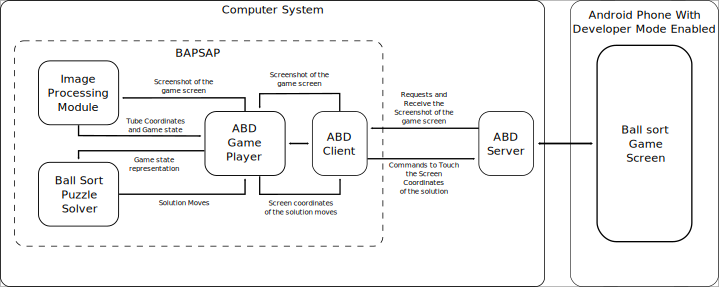

# BAPSAP (BAllsort Puzzle Solver And Player)
A Command line tool to solve and play ballsort puzzle game using one of the following:
    - ADB(Android Debugging Bridge)
    - Screenshot of the level
    - json file representing the level state

## Architecture
### Components
- ABD (Android Debugging Bridge) Client
- ABD Player
- Image Processing Module
- Ball Sort Puzzle Solver



## Usage
### Using ADB
1. Make sure that the android device has debugging mode enabled.
2. Connect the android device using usb file tansfer mode enabled.
3. Start the adb server using the command `$ adb start-server`
4. Run the bapsap using the command `$ python -m bapsap`

### Using Screenshot file
```bash
python -m bapsap -f <filename>
```
### Using Json file
```bash
python -m bapsap -j <filename>
```

### Setting search strategies
```bash
python -m bapsap -s <strategy_name>
```
Available strategies are:
- dfs - Deapth First Search
- bfs - Breadth First Search
- sahc_with_negative_state_entropy - Steepest Accent Hill Climbing with Negative State Entropy as the heuristic Function.

#### State Entropy
State Entropy is the sum of tube entropies of all the tubes in the state.
where tube entropy of the state  is defined as:
1. 1 + (the number of discontinuties in the color of the two adjacent balls) for non empty tubes
2. 0 for empty tubes  


